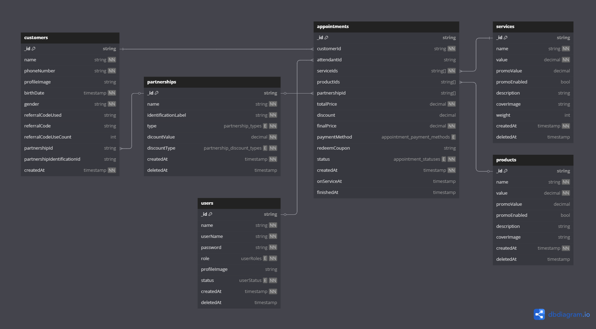

<h1 align="center">Thompson & Hill - Barbershop</h1>

<p align="center">
<a href="https://nestjs.com/">

</a>
<a href="https://nextjs.org/">
  
</a>
<a href="https://www.typescriptlang.org">

</a>
<a href="https://www.prisma.io/">

</a>
<a href="https://www.postgresql.org/">
  
</a>
<a href="https://firebase.google.com/">
  
</a>
<a href="https://jestjs.io/">

</a>
<a href="https://swagger.io/">

</a>
<a href="http://www.passportjs.org/">
  
</a>
<a href="https://github.com/colinhacks/zod">
  
</a>
<a href="https://tailwindcss.com/">
  
</a>
<a href="https://github.com/colinhacks/zod">
  
</a>
<a href="https://react-query.tanstack.com/">
  
</a>
<a href="https://www.docker.com/">
  
</a>
</p>

<p align="center">

</p>

Thompson & Hill - Barbershop is a fullstack monolithic web application designed to manage barbershop operations efficiently.

## 🔧 Backend (API)

- **Framework**: [Nest.js](https://nestjs.com/)
- Language: TypeScript
- **Architecture**: Modular, resource-based structure
- **API** Pattern: RESTful
- **Authentication**: JWT-based
- **User** Roles: admin, manager, totem, attendant
- **Validation**: Input validation with Zod
- **Testing**: Integration tests (npm run test)
- **Containerization**: Docker-ready

### 🔐 Enviroment Variables

Use the .env file to configure the API. Do not commit sensitive values.

```
# Environment variables for the Thompson Hill Barbershop API
# This file is used to configure the environment for the API server.
# Do not commit this file to version control. Use .env.example as a template.

# NODE_ENV can be "development" or "production"
NODE_ENV="development"

# PORT is the port on which the API server will run
PORT="3333"

# Secret to use for signing JWT tokens must be at least 32 characters hex long
JWT_SECRET=""

# JWT_EXPIRES_IN is the duration for which the JWT token will be valid
JWT_EXPIRES_IN=""

# Admin user credentials for the API
ADMIN_USER=""
ADMIN_PASSWORD=""

# Mongo database URI for connection
MONGODB_URI=""

# Google Firebase bucket name
FIREBASE_STORAGE_BUCKET=""

# Google Firebase service account credentials in base64 format
FIREBASE_SERVICE_ACCOUNT_B64=""
```

### 🗃️ Database Schema

<p align="center">

</p>

### 📖 API Swagger live documentation

Live Swagger documentation is available at: [https://thompsonehillbarbershop.onrender.com/v1/docs](https://thompsonehillbarbershop.onrender.com/v1/docs)

<p align="center">

</p>

### 🚀 Deployment Requirements

Minimum requirements to self-host the application:

- Linux-based VPS
- Node.js 20+
- At least 1 CPU core
- Minimum 512MB RAM

### ☁️ Deployment Details

#### 🔌 API Server (Nest.js)

- Hosted on [Render](https://render.com/) - Free Tier
- Specs: 0.1 CPU, 512MB RAM
- URL [https://thompsonehillbarbershop.onrender.com](https://thompsonehillbarbershop.onrender.com)
- Access email = app.thompsonehillbarbershop@gmail.com

#### 🧾 Database (MongoDB)

- Hosted on [MongoDB Atlas](https://www.mongodb.com/products/platform/atlas-database) - Free Tier
- Storage Limit: 512MB
- Access email = app.thompsonehillbarbershop@gmail.com

#### 📦 Firebase Storage

- Plan: Blaze (free tier with 5GB storage)
- Used for file uploads
- Access email = app.thompsonehillbarbershop@gmail.com

#### 🔥 Firebase Firestore

- Plan: Blaze (free tier with 1GB storage)
- Used for real time data storage
- Access email = app.thompsonehillbarbershop@gmail.com

## 💻 Frontend (Web App)

The frontend is a modern, responsive interface designed to run on tablets (totem usage), desktop dashboards, and mobile devices (management access).

### 🛠️ Tech Stack

- **Framework**: [Next.js](https://nextjs.org/) (App Router)
- **Language**: TypeScript
- **UI Framework**: [Tailwind CSS v4](https://tailwindcss.com/) + [ShadCN UI](https://tailwindcss.com/)
- **State Management**: [TanStack Query](https://tanstack.com/query/latest/docs/framework/react/overview)
- **Form Validation**: [React Hook Form](https://react-hook-form.com/) + [Zod](https://zod.dev/)
- **Authentication**: JWT via cookie/session
- **HTTP Client**: fetch with [TanStack Query](https://tanstack.com/query/latest/docs/framework/react/overview) + [Axios](https://axios-http.com/ptbr/docs/intro)
- **Containerization**: Docker-ready

### 🧭 Layouts Overview

- Admin Area: Full dashboard access to manage users, services, customers, appointments, and referral partnerships.
- Totem Mode: Tablet-optimized interface for self-service registration and appointment creation.
- Attendant Area: Optimized view for managing customers and appointments on tablets or phones.

### 🌐 General Features

- Full TypeScript support with strict type checking
- Responsive design tested across desktop, tablets, and mobile
- Role-based access control for all routes
- Automatic redirect for unauthorized access
- Session expiration and auto logout
- Firebase Storage integration for image uploads
- Lazy-loaded images for performance

### 🔐 Enviroment Variables

Use the .env file to configure the frontend. Do not commit sensitive values.

```
# Environment variables for the Thompson Hill Barbershop Web Application
# This file is used to configure the environment for the web application.
# Do not commit this file to version control. Use .env.example as a template.

# NODE_ENV can be "development" or "production"
NODE_ENV="development"

# Url of the API server
API_URL="http://localhost/v1"

# Auth
# JWT secret key for signing tokens, must be at least 32 characters hex long
SESSION_SECRET_KEY=""
# JWT expiration time, duration for which the JWT token will be valid
SESSION_EXPIRATION_TIME=""

# Firebase Public Configuration
NEXT_PUBLIC_FIREBASE_API_KEY=""
NEXT_PUBLIC_FIREBASE_AUTH_DOMAIN=""
NEXT_PUBLIC_FIREBASE_PROJECT_ID=""
NEXT_PUBLIC_FIREBASE_STORAGE_BUCKET=""
NEXT_PUBLIC_FIREBASE_MESSAGING_SENDER_ID=""
NEXT_PUBLIC_FIREBASE_APP_ID=""
```

### 🔄 Authentication Flow

<p align="center">

</p>

### 🔑 Login Flow

<p align="center">

</p>

### 🖼️ Image Upload Flow

<p align="center">

</p>

### 📲 Totem Features

- Customer registration via phone number
- Service selection interface
- Optional attendant selection
- Optional referral code input
- Optional partnership selection
- Fullscreen tablet UI
- Hidden logout: Enter 99999999999 in phone field to exit

### 🧑‍💼 Admin Features

- User management (roles and access)
- Service catalog and pricing management
- Product catalog and pricing management
- Customer data management
- Appointment tracking and history
- Partnership management
- Optimized for desktop and tablet

### 🧾 Attendant Features

- Manage and check in appointments
- Guided multi-step forms for faster input
- Designed for tablet and mobile use

### 🧾🧑‍💼 Attendant Manager Features

- Manage and check in appointments
- Guided multi-step forms for faster input
- Set attendants status
- Designed for tablet and mobile use

### 🚀 Deployment Requirements

Minimum requirements to self-host the application:

- Linux-based VPS
- Node.js 20+
- At least 1 CPU core
- Minimum 512MB RAM

### ☁️ Deployment Details

- Hosted on [Vercel](https://vercel.com/) - Free Tier
- Specs: 0.1 CPU, 512MB RAM
- URL [https://thompsonehillbarbershop.vercel.app/](https://thompsonehillbarbershop.vercel.app/)
- Access email = app.thompsonehillbarbershop@gmail.com

